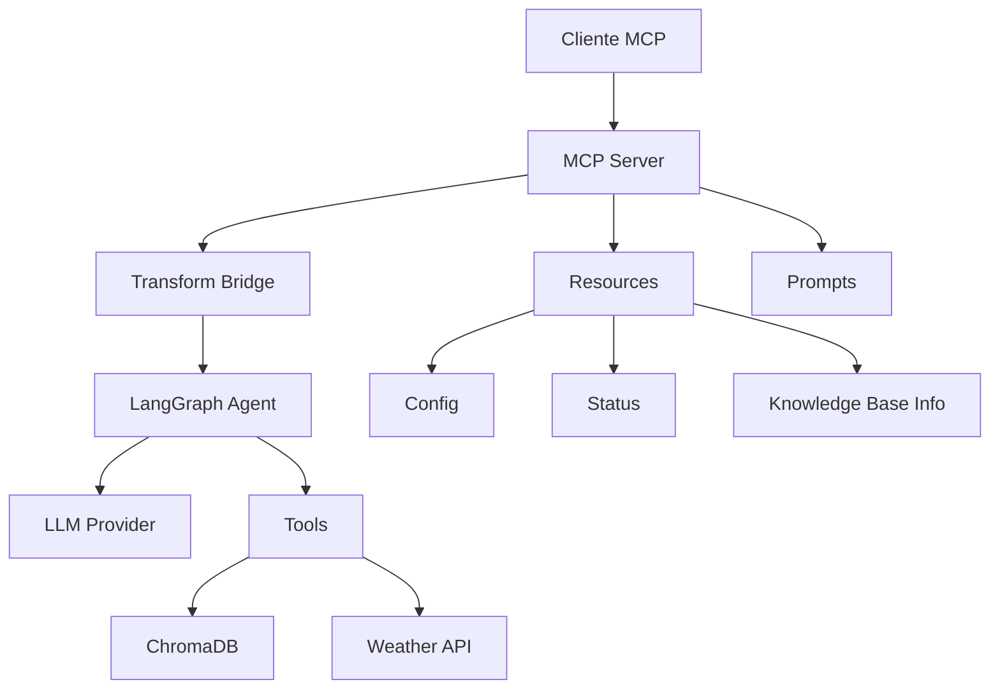

# LangGraph Agent com MCP Bridge

Este projeto implementa um agente inteligente usando LangGraph com acesso a uma base de conhecimento vetorial e integração MCP (Model Context Protocol).

## 🚀 Configuração

### 1. Instalar dependências
```bash
pip install -r requirements.txt
```

### 2. Configurar variáveis de ambiente
Copie o arquivo `.env.example` para `.env` e ajuste as configurações:

```bash
cp .env.example .env
```

#### Configurações disponíveis:

**Provedor Principal:**
- `MAIN_PROVIDER`: Provedor LLM principal ('ollama', 'openai', 'gemini') (padrão: ollama)

**Ollama:**
- `OLLAMA_BASE_URL`: URL do servidor Ollama (padrão: http://localhost:11434)
- `OLLAMA_MODEL`: Modelo LLM principal (padrão: llama3:latest)
- `OLLAMA_EMBEDDINGS_MODEL`: Modelo para embeddings (padrão: nomic-embed-text)

**OpenAI:**
- `OPENAI_API_KEY`: Sua chave de API da OpenAI
- `OPENAI_MODEL`: Modelo OpenAI (padrão: gpt-3.5-turbo)

**Google Gemini:**
- `GEMINI_API_KEY`: Sua chave de API do Google AI Studio
- `GEMINI_MODEL`: Modelo Gemini (padrão: gemini-1.5-flash)

**ChromaDB:**
- `CHROMA_PERSIST_DIRECTORY`: Diretório de persistência (padrão: ./chroma_db)

**Busca Vetorial:**
- `VECTOR_SEARCH_K_RESULTS`: Número de resultados da busca (padrão: 3)

**MCP Server:**
- `MCP_SERVER_NAME`: Nome do servidor MCP (padrão: LangGraphToolsMCP)

### 3. Configurar Provedor LLM

**Para Ollama (padrão):**
```bash
# O arquivo .env já está configurado para Ollama
ollama serve
```

**Para OpenAI:**
```bash
# Editar .env
MAIN_PROVIDER=openai
OPENAI_API_KEY=sua_chave_aqui

# Instalar dependência
pip install langchain-openai
```

**Para Google Gemini:**
```bash
# Editar .env
MAIN_PROVIDER=gemini
GEMINI_API_KEY=sua_chave_aqui

# Instalar dependência
pip install langchain-google-genai
```

### 4. Testar Provedores
```bash
python test_providers.py
```

## 🎯 Uso

### Executar o agente principal
```bash
python agent.py
```

### Executar servidor MCP
```bash
fastmcp run mcp_server.py
```

### Executar servidor MCP com HTTP
```bash
fastmcp run mcp_server.py --transport streamable-http --host 127.0.0.1 --port 8088
```

### Testar servidor MCP
```bash
python test_mcp.py
```

### Usar MCP Inspector (Interface Web)
```bash
# Instalar MCP Inspector
pip install mcp-inspector

# Executar (em terminal separado)
mcp-inspector

# Abrir navegador em http://localhost:3000
# Conectar em: http://127.0.0.1:8088/mcp
```

## 🔧 Funcionalidades

- **Agente Inteligente**: Processa perguntas usando LangGraph
- **Base de Conhecimento**: Busca vetorial com ChromaDB
- **Integração MCP Completa**: Bridge para ferramentas LangChain + Resources + Prompts
- **MCP Resources**: Acesso a configurações, status e informações da base de conhecimento
- **MCP Prompts**: Templates predefinidos para diferentes tipos de consultas
- **Orquestração Inteligente**: Decide automaticamente quando usar ferramentas vs resposta direta
- **Configuração Flexível**: Todas as configurações via variáveis de ambiente
- **Múltiplos Provedores**: Suporte para Ollama, OpenAI e Google Gemini
- **Arquitetura Modular**: Sistema componentizado para fácil extensão

## 📁 Estrutura do Projeto

```
langgraph/
├── agent.py                     # Agente principal com interface de linha de comando
├── mcp_server.py               # Servidor MCP completo com Tools, Resources e Prompts
├── graphs/
│   ├── __init__.py
│   └── graph.py                # Lógica isolada do LangGraph (grafo, nós, estados)
├── providers/
│   ├── __init__.py
│   └── llm_providers.py        # Sistema modular de provedores LLM
├── tools/
│   ├── __init__.py
│   └── tools.py                # Ferramentas de busca vetorial e weather
├── transform/
│   ├── __init__.py
│   └── lang_mcp_transform.py   # Bridge entre LangChain e MCP
├── logger/
│   ├── __init__.py
│   └── logger.py               # Sistema de logging colorido
├── .env                        # Configurações do ambiente (não commitado)
├── .env.example               # Exemplo de configurações
└── requirements.txt           # Dependências do projeto
```

## 🌐 Integração MCP

### MCP Tools
- `search_knowledge_base`: Busca na base vetorial ChromaDB
- `get_weather`: Informações meteorológicas atuais
- `langgraph_orchestrator`: Agente completo com orquestração inteligente

### MCP Resources
- `config://agent`: Configuração do agente e ferramentas disponíveis
- `knowledge://base`: Informações sobre a base de conhecimento vetorial
- `status://system`: Status geral do sistema (servidor, agente, tools)

### MCP Prompts
- `agent-query`: Template flexível para consultas (estilos: conversational, technical, concise, educational)
- `knowledge-search`: Template otimizado para busca na base de conhecimento
- `weather-query`: Template para consultas meteorológicas
- `tool-orchestration`: Template para tarefas que precisam de múltiplas ferramentas

### Usando MCP Inspector
1. Execute o servidor MCP: `fastmcp run mcp_server.py --transport streamable-http --host 127.0.0.1 --port 8088`
2. Execute o MCP Inspector: `mcp-inspector`
3. Abra o navegador em `http://localhost:3000`
4. Conecte em: `http://127.0.0.1:8088/mcp`
5. Explore Tools, Resources e Prompts na interface web

## 🏗️ Arquitetura

### Componentes Principais

1. **Agent (agent.py)**
   - Interface de linha de comando
   - Loop interativo para conversação
   - Inicialização e configuração do sistema

2. **Graph (graphs/graph.py)**
   - Implementação do grafo LangGraph
   - Nós de decisão e execução 
   - Estado do agente e fluxo de mensagens
   - Orquestração entre ferramentas e resposta direta

3. **Providers (providers/llm_providers.py)**
   - Sistema modular de provedores LLM
   - Suporte para Ollama, OpenAI, Gemini
   - Configuração automática via variáveis de ambiente

4. **Tools (tools/tools.py)**
   - Ferramentas LangChain (busca vetorial, clima)
   - Integração com ChromaDB e APIs externas

5. **Transform (transform/lang_mcp_transform.py)**
   - Bridge entre LangChain e MCP
   - Conversão automática de ferramentas
   - Wrapper assíncrono para compatibilidade

6. **MCP Server (mcp_server.py)**
   - Servidor MCP completo
   - Exposição de Tools, Resources e Prompts
   - Interface web via MCP Inspector

### Fluxo de Dados



### Decisão de Orquestração

O agente decide automaticamente entre:

1. **Resposta Direta**: Para conversas gerais
2. **Busca na Base**: Para tópicos técnicos (python, IA, etc.)
3. **Ferramentas Externas**: Para clima, cálculos específicos
4. **Combinação**: Usar múltiplas ferramentas quando necessário